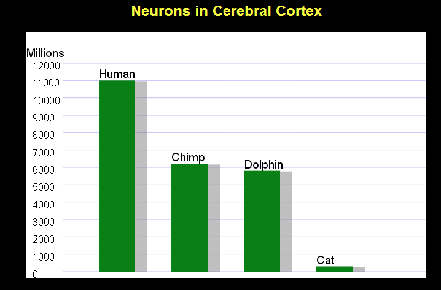
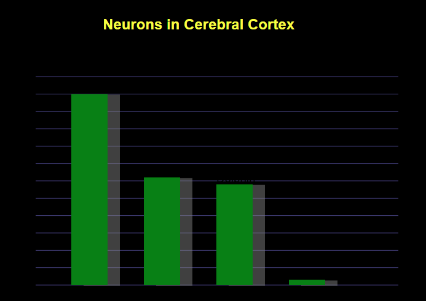

The HTML `<canvas>` element renders as pixels on a screen and it renders the same way a .jpg or .png would. Its often used for HTML5 desktop and mobile game development. While it is supported in all browsers its not accessible to screen readers without adding JavaScript, ARIA, or having an internal fallback in the content placed within the opening and closing tags of the element.

When using interactive content or custom controls you should use SVGs because it has internal accessibility semantics and you can easily add any interaction with JavaScript. Also you should avoid using `<canvas>` elements to generate any text because it renders like a .jpg or .png would, meaning when enlarged it can be come pixillated and hard to read.

## What should a `<canvas>` element have

- An accessible name
- An accessible descirption that matches the visible text and content in the drawing area
- When used as a mouse/keyboard operable UI must have a role
  - `role="button"`

When your providing alternative text for a `<canvas>` element you should make sure that its meaningful. By meaningful I mean make sure that the text describes the purpose or intent of the image. If you have a complex canvas like a bar graph or pie chart you must make sure that the alternative text must have all of the text or data that is presented. If your alternative text needs to be more than 150 characters its best practice to represent that information in another way such as a long description or a table below the data element that is referenced by an `aria-describedby`.

Also you need to make sure you designate the canvas as an image by giving it a `role="img"` and making sure it has an `aria-label` or `aria-labelledby` for an accessible name.

### Keyboard accessibility

YOu must make sure that `<canvas>` elements also work with a keyboard and that their hover styles match the focus styles. Their `onclick` and `onmousedown` should have keyboard events that check for an enter or spacebar key activation.

### `tabindex` and `<canvas>` elements

To ensure that your `<canvas>` element is focusable by keyboards you can add a `tabindex="0"` to the `<canvas>` element. Adding this though will not make it activate though when an enter or spacebar key is clicked, extra events will need to be added via JavaScript to make this happen.

## Canvas examples

**_Fallback content for `<canvas>` element_**

    <canvas id="coolstuff">
        HTML5 canvas support is required for a fully interactive experience, so here’s this:  
        
    </canvas>

**_`<canvas>` elements and low vision_**
You should make sure that all `<canvas>` elements have a background fill. This is important because if it does not have a background and a user changes their color/contrast preferences the data may not be visible.

**_Example of a canvas with a background color_**

**_Example of a canvas without a background color_**

**_Good example of a `<canvas>` with an aria-label_**

    <canvas id="goodCanvas1" width="200" height="100" style="margin: 0 auto;" role="img"
    aria-label="A red and white circular target with an arrow
        pointing to the center of the target">
    </canvas>
    

    <canvas id="goodCanvas1" width="700" height="100" role="img" aria-label="A red and white circular target with an arrow pointing to the center of the target">
    </canvas>

**_Bad example of a `<canvas>` element_**

    <canvas id="badCanvas1" width="400" height="100">
    </canvas>

This is a bad example because there is no accessible name for the canvas.

